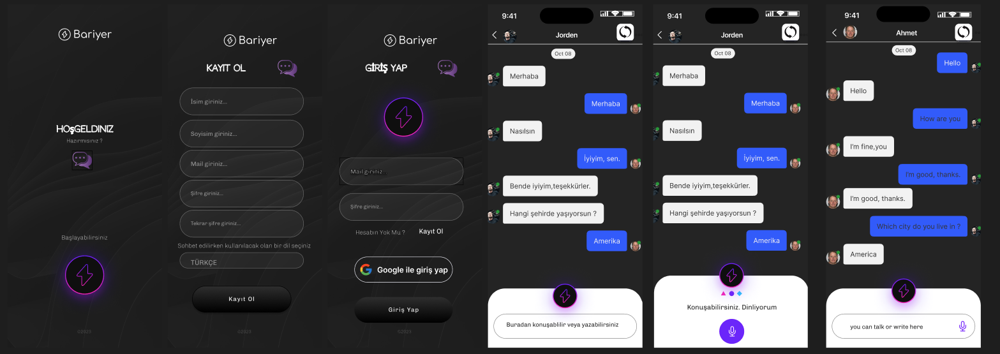

# React Native Mesajlaşma Uygulaması

## Proje Hakkında
Bu proje, Microsoft Azure Translator API ile desteklenen bir React Native uygulamasıdır. Uygulama, kullanıcıların yazılı metinleri istedikleri dile anında çevirmelerine olanak tanır. Özellikle çok dilli iletişimin önemli olduğu durumlar için pratik bir çözüm sunar.

## Proje Amacı
Farklı dilleri konuşan insanlar arasındaki iletişim engellerini aşmayı amaçlayan bir mesajlaşma uygulaması geliştirmeyi hedeflemektedir. Uygulama, dil seçeneklerini destekleyerek sesli iletişimi metne dönüştürmekte ve diller arasında anlık çeviri yaparak etkili iletişim sağlamaktadır. İş, eğitim, turizm ve sosyal hayat gibi farklı alanlarda kullanılarak uluslararası işbirliklerini, öğrenme deneyimlerini ve kişisel ilişkileri güçlendirmeyi amaçlamaktadır.

## Uygulamanın Resimleri

## Kullanılan Teknolojiler
* **React Native – Mobil uygulama geliştirme.**
* **Axios – HTTP isteklerini yapmak için.**
* **Microsoft Azure Translator API – Metin çeviri hizmeti.**
* **Node.js – API istekleri ve backend entegrasyonu için.**
